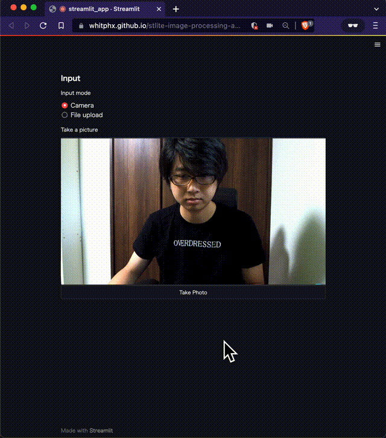

# Serverless Image Processing App

It’s running on [stlite](https://github.com/whitphx/stlite), **Serverless Streamlit**,
so any data is never transmitted to external servers, and everything is working on your local browser environment.
Though some resources will be downloaded at initialization and runtime, after these are loaded, this app can work offline.

This is kind of a demonstration of [stlite](https://github.com/whitphx/stlite) and some Python packages built for client-side such as OpenCV and Matplotlib.

## Tutorial Video
A great Streamlit content creator, [1littlecoder](https://www.youtube.com/c/1littlecoder) created a YouTube video explaining (a subset of) this app. Check it out!

[Serverless Streamlit + OpenCV Python Web App Tutorial](https://youtu.be/7Qja9ZAWcfw)
